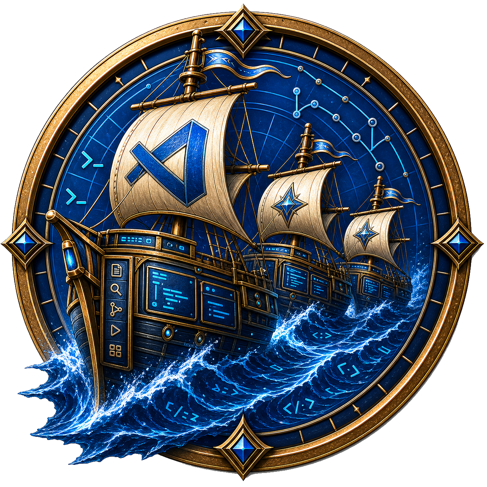

> This is an agent coded app I put together because I had personal use for it, that will be updated when I personally require new features. I'm providing it as is to see if there is more general interest in vs-code multiplexing. If this project gets any more general interest I'll take it more seriously. PRs and issues welcome.

<p align="center">
  
</p>

<h1 align="center">VS Fleet</h1>

<p align="center">
  Experimental desktop app for managing local VS Code web sessions used by terminal-based coding agents.
</p>

<p align="center">
  
  
  <a href="LICENSE"></a>
</p>

## What is VS Fleet?

VS Fleet is a compact desktop app for supervising local `code serve-web` sessions.
It collects editor and agent state, shows each session in a small Fleet window,
and switches between sessions without owning agent processes or capturing
keystrokes.

The current implementation is intentionally local-only: it uses the installed VS
Code CLI and starts local web sessions from the Fleet app.

## Features

- Launch local VS Code web sessions from the Fleet window.
- Open a new session in the home directory or in a selected local folder.
- View, rename, mute, dismiss, and switch between sessions.
- Track unread and waiting state from terminal-based coding agents.
- Keep Fleet as a client: editor sessions and reporters connect back to Fleet.

## Requirements

- macOS or Linux (Windows builds are alpha; agent-state reporting is not yet
  supported there).
- A local VS Code installation with the `code` command available.
- Rust and Node.js tooling for building from source.

## Getting Started

Download an unsigned alpha build from
[Releases](https://github.com/msmfai/Vs-Fleet/releases) (macOS dmg, Linux AppImage/deb/rpm) and verify it
against `SHA256SUMS.txt` — see the release notes for the per-OS unsigned-binary
caveats.

Or build the macOS app from source:

```sh
cd crates/fleet-host
./bundle.sh debug
open Fleet.app
```

From Fleet, use the plus menu to start a local session in your home folder or
open another local folder. Remote and container launch paths are not currently
supported user workflows.

## Components

| Component | Path | Description |
|---|---|---|
| Fleet host | `crates/fleet-host` | Tauri desktop app, session list, embedded VS Code webviews, local bridge, and local session launcher. |
| Fleet Bridge | `packages/fleet-bridge` | VS Code extension packaged into the app and installed into spawned `code serve-web` profiles. |
| Fleet reporter | `crates/fleet-reporter` | Reports editor/session/agent state back to Fleet. |
| Fleet hub | `crates/fleet-hub` | Local state projection used by the host, reporter, and CLI. |

`crates/fleet-host/bundle.sh` builds the Rust host, builds the Fleet Bridge
VSIX, copies both into `Fleet.app`, and includes the reporter binary used by
spawned sessions.

## Status

VS Fleet is an experimental prototype published to validate whether a dedicated
local control surface for VS Code session multiplexing is useful to other
developers. It is available for early evaluation and feedback, but it should not
be treated as production-ready software.

Maintenance is currently driven by the maintainer's own use cases. Sustained
product, support, and release engineering investment will depend on demonstrated
external demand.

Current support boundary:

- Local desktop app; macOS is the primary platform, Linux and Windows are alpha.
- Local `code serve-web` sessions launched from the local VS Code install.
- Unsigned binary releases (see [Releases](https://github.com/msmfai/Vs-Fleet/releases)); no signing or
  notarization yet.

## Documentation

- [Quickstart](docs/QUICKSTART.md)
- [Architecture overview](docs/ARCHITECTURE.md)
- [Local data and uninstall](docs/LOCAL_DATA_AND_UNINSTALL.md)
- [Engineering spec](docs/ENGINEERING_SPEC.md)
- [Release process](docs/RELEASING.md)

## Limitations

- Binary releases are unsigned; no signing or notarization policy yet.
- Windows: sessions and tabs work, but agent-state reporting (the reporter
  hook receiver and terminal shim) is unix-only for now.
- Remote/container deployment: design and eval harness code exists, but it is
  not a supported user path yet.
- External contributions: DCO sign-off is required; large outside code changes
  are reviewed conservatively while the project is small.

## Project Structure

| Path | Purpose |
|---|---|
| `crates/fleet-protocol` | JSON-serializable protocol types. |
| `crates/fleet-hub` | Local Hub process and state projection. |
| `crates/fleet-reporter` | Reporter adapters and reporter binary. |
| `crates/fleet-cli` | CLI face, currently `fleet ls` and related commands. |
| `crates/fleet-host-core` | Pure Rust inbox/view-model logic. |
| `crates/fleet-host` | Standalone Tauri host app. |
| `packages/fleet-bridge` | VS Code bridge extension packaged into the host app. |
| `packages/extension` | VS Code extension face. |
| `containers/fleet-env` | Container/eval harness material. |
| `docs` | User and engineering documentation. |

## Development

Core workspace:

```sh
cargo fmt --all -- --check
cargo test --workspace --all-targets --all-features
```

Fleet host:

```sh
cd crates/fleet-host
cargo test
./bundle.sh release
```

## Security and Privacy

Fleet is local-first and has no intended telemetry by default. It can still log
local metadata such as workspace paths, local URLs, session labels, process
command lines, and editor state. Scrub logs and screenshots before sharing them
publicly.

Local runtime data lives under `~/.fleet/run` and `~/.fleet/mux` unless
`FLEET_RUNTIME_DIR` or `FLEET_MUX_DIR` is set. Manual cleanup is documented in
[Local data and uninstall](docs/LOCAL_DATA_AND_UNINSTALL.md).

## Legal

Fleet uses the local `code serve-web` install. Fleet does not download, bundle,
host, or redistribute Microsoft's VS Code Server, Microsoft Marketplace
extensions, or Microsoft remote extensions.

See [SECURITY.md](SECURITY.md) for the current security policy.
See [SUPPORT.md](SUPPORT.md) for the current support boundary.

## License

Fleet is licensed under the MIT License. See [LICENSE](LICENSE).
